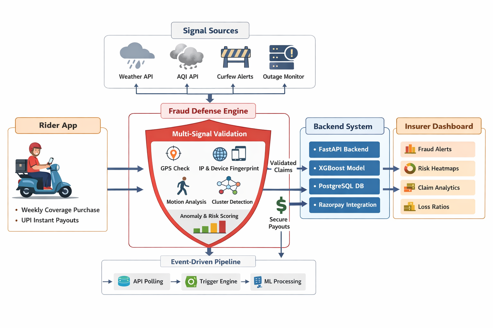

# 🚀 GigVault 🔒
### AI-Powered Parametric Income Insurance for Q-Commerce Delivery Partners  
**“Your income, protected before you even realize it’s at risk.”**

---

## ⚡ TL;DR

GigVault is a **real-time, AI-driven parametric insurance platform** that protects delivery riders from income loss caused by external disruptions (weather, AQI, outages).

It automatically:
- Detects disruptions 📡  
- Verifies real activity 🔍  
- Triggers claims ⚡  
- Pays instantly 💸  

All powered by a **fraud-resilient, adversarial defense system**.

---

## 🧑‍💼 The Problem

India’s Q-Commerce delivery partners operate in a **zero-safety-net economy**.

Even short disruptions lead to **instant income collapse**:

- 🌧️ Rain → orders disappear  
- 🌫️ AQI → delivery throttling  
- 🚧 Curfews → zero access  
- ⚙️ App outages → silent income loss  

👉 Riders lose **20–30% of weekly income** with no fallback.

---

## 👤 Persona: The Q-Commerce Rider

**Ravi (26, Bangalore)**  
- Platforms: Zepto + Blinkit  
- Earnings: ₹800–₹1200/day  
- Reality: One disruption = ₹900 lost  

> “If I don’t work today, I don’t earn today.”

---

## ⚠️ Why Traditional Insurance Fails

| Traditional | GigVault |
|------------|----------|
| Manual claims | Zero-touch automation |
| Slow payouts | Instant payouts |
| Requires proof | Parametric triggers |
| Complex process | Rider-friendly |

---

## 🛡️ What GigVault Does

### 🔄 End-to-End Workflow

1. Rider purchases weekly coverage  
2. System monitors real-time signals (weather, AQI, outages)  
3. Disruption detected  
4. Multi-layer validation (activity + trust + signals)  
5. Claim auto-approved  
6. Instant UPI payout  

---

## 💰 Weekly Pricing Model

- Coverage cycle: **Monday → Sunday**
- AI-adjusted premium per rider

### 📊 Coverage Tiers

| Tier | Weekly Premium | Max Payout |
|------|---------------|------------|
| Basic | ₹29 | ₹500 |
| Standard | ₹59 | ₹1200 |
| Max | ₹99 | ₹2500 |

---

## 🤖 AI-Powered Dynamic Pricing

### Model: XGBoost

### Why XGBoost?
- Handles **non-linear risk patterns**
- Works with **real-world tabular data**
- Interpretable → critical for insurance trust

### Inputs:
- Zone Risk Score (ZRS)
- Weather forecast trends
- Rider activity consistency
- Historical claim behavior

### Output:
- Personalized weekly premium

**Example:**  
Ravi (high-risk monsoon zone) → ₹59 → +₹20 risk → **₹79/week**

---

## ⚡ Parametric Triggers (Zero Manual Claims)

| Trigger | Threshold | Payout Logic |
|--------|----------|--------------|
| Rainfall | >15mm/hr | Hourly payout |
| AQI | >400 | ₹200 |
| Heat | >44°C | ₹150 |
| Curfew | Official notice | Full payout |
| Outage | >45 mins | ₹100 / 30 min |

> Only **externally verified triggers** initiate claims — never user-reported data.

---

## 🧠 AI Risk & Fraud Engine

### 1. Risk Profiling
- Zone Risk Score (ZRS)
- Updated weekly
- Predictive disruption alerts

### 2. Anomaly Detection
- Isolation Forest (claim anomalies)
- Time-series spike detection
- Claim-to-activity mismatch detection

---

## 🚨 Adversarial Defense & Anti-Spoofing Strategy

### ⚠️ Market Crash Scenario

A coordinated fraud ring of 500 riders uses GPS spoofing to simulate disruption exposure and drain payouts.

---

## 🛡️ Multi-Signal Trust Engine (Zero-Trust Architecture)

> GigVault assumes **every signal can be compromised**.

Each claim is validated across multiple independent signals:

### 🔍 Signals Used:
- 📍 GPS (baseline, low trust)
- 🌐 IP Geolocation (VPN/proxy detection)
- 📱 Device Fingerprinting (unique device identity)
- 📡 Motion Sensors (real vs simulated movement)
- 🚴 Platform Activity Logs (actual delivery behavior)

### 🚨 Fraud Logic:
- GPS ≠ IP → 🚩 flag  
- No motion data → 🚩 flag  
- Same device across accounts → 🚩 flag  

---

## 🧩 Behavioral & Pattern Intelligence

- Consistent working hours  
- Realistic movement paths  
- Delivery frequency patterns  
- Claim timing anomalies  

---

## 🕸️ Fraud Ring Detection (Graph Intelligence)

Fraud is treated as a network problem.

- Nodes → Riders  
- Edges → Shared signals (IP, device, location)  

### Detect:
- Coordinated clusters  
- Simultaneous claims  
- Shared infrastructure  

👉 Entire fraud rings are identified and isolated, not just individuals.

---

## ⏱️ Temporal Validation

- Was rider active before disruption?  
- Did activity drop during event?  
- Did it resume after?  

---

## ⚖️ Trust Score Economy (Key Innovation)

Each rider has a **Trust Score (0–100)**:

### Based on:
- Activity consistency  
- Claim history  
- Behavioral reliability  

### Impact:
- High trust → instant payouts ⚡  
- Low trust → stricter validation  

> GigVault builds a **reputation-based financial identity** for gig workers.

---

## 🧨 System Behavior During a Market Crash

When attack patterns are detected:

- Claim approvals are throttled  
- High-risk clusters are sandboxed  
- Only high-trust users receive instant payouts  
- Validation thresholds dynamically increase  

> The system shifts from  
**“fast payout mode” → “defensive survival mode”**

---

## 🧱 System Stability Under Attack

- Queue-based claim processing  
- Batch validation for clusters  
- Early fraud filtering before payout  
- Region-level isolation  

👉 Prevents liquidity drain and cascading payouts.

---

## ⚖️ Fairness Layer (Protecting Genuine Workers)

- No rejection based on single anomaly  
- Trust-weighted approvals  
- Partial payouts for uncertainty  
- Manual review fallback  

**Example:**  
A consistent rider is approved instantly, even if part of a flagged cluster.

---

## 🧩 System Architecture

**Event-Driven, Real-Time Pipeline**

- Frontend: React PWA  
- Backend: FastAPI  
- Database: PostgreSQL  
- ML Engine: Python + XGBoost  
- Trigger Engine: API polling + scheduler  
- Payments: Razorpay (test mode)  



> Event-driven, fraud-resilient pipeline designed for real-time parametric insurance.

---

## 📊 Analytics Dashboard

### 👷 Rider View:
- Earnings protected  
- Coverage status  
- Claim history  

### 🏢 Insurer View:
- Fraud heatmaps  
- Loss ratios  
- Risk predictions  
- Claim spikes  

---

## 🚀 Tech Stack

| Layer | Tech |
|------|------|
| Frontend | React |
| Backend | FastAPI |
| Database | PostgreSQL |
| ML | XGBoost |
| APIs | OpenWeather, AQICN |
| Payments | Razorpay |
| Hosting | Vercel + Render |

---

## 🗓️ Development Plan

### Phase 1 (Seed)
- Idea, pricing, triggers  
- Basic UI + APIs  

### Phase 2 (Scale)
- Automation  
- Claims engine  
- ML model  

### Phase 3 (Soar)
- Fraud detection  
- Dashboards  
- Full demo  

---

## 📦 Repository Structure

```

gigvault/
├── frontend/
├── backend/
├── data/
├── docs/
└── README.md

````

---

### ▶️ How to Run

### Frontend
```bash
cd frontend
npm install
npm run dev
````

### Backend

```bash
cd backend
python -m venv venv
source venv\Scripts\activate (Windows)
pip install -r requirements.txt
uvicorn main:app --reload
```

---

## 🎥 Demo

* Phase 1: Strategy Video
  [https://www.youtube.com/watch?v=Ne7Pmxbulxg](https://www.youtube.com/watch?v=Ne7Pmxbulxg)

* Phase 2: Prototype Demo

* Phase 3: Full Simulation

---

## 💼 Business Model

* Revenue → Weekly premiums
* Cost → Payouts
* Target Loss Ratio → 60–65%

> Profitability scales with diversified risk pools and fraud minimization.

---

## 🌟 Key Innovations

* Parametric income insurance (weekly model)
* Zero-touch claims
* AI-driven hyper-local pricing
* Adversarial fraud defense system
* Trust Score-based insurance

---

## 📌 Constraints Compliance

* ✅ Income loss only
* ✅ Weekly pricing
* ✅ External parametric triggers
* ✅ AI + fraud detection
* ✅ Single persona focus

---

## 👥 Team

**Tech Titans**
Sohini, Umesh, Manideep, Koushik
SRMIST

---

## 🏆 Final Statement

> GigVault is not just an insurance platform.
> It is a fraud-resilient financial infrastructure designed to protect gig workers — even under coordinated adversarial attacks.

